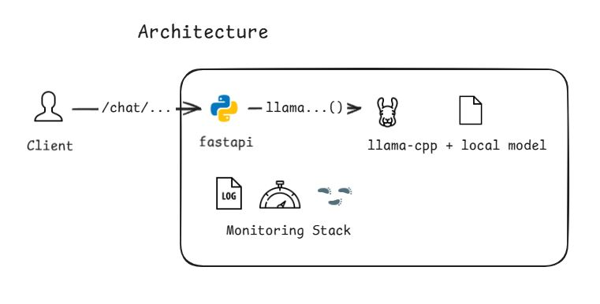

# Small-Language-Model Server

[](https://github.com/XyLearningProgramming/slm_server/actions/workflows/ci.yml)
[](https://codecov.io/gh/XyLearningProgramming/slm_server)
[](https://hub.docker.com/r/x3huang/slm_server)
[](LICENSE)

🚀 A light model server that serves small language models (default: `Qwen3-0.6B-GGUF`) as a **thin wrapper** around `llama-cpp` exposing the OpenAI-compatible `/chat/completions` API. Core logic is just <100 lines under `./slm_server/app.py`!

> This is still a WIP project. Issues, pull-requests are welcome. I mainly use this repo to deploy a SLM model as part of the backend on my own site [x3huang.dev](https://x3huang.dev/) while trying my best to keep this repo model-agonistic. 

## ✨ Features



- 🔌 **OpenAI-compatible API** - Drop-in replacement with `/chat/completions` endpoint and streaming support
- ⚡ **Llama.cpp integration** - High-performance inference optimized for limited CPU and memory resources
- 📊 **Production observability** - Built-in logging, Prometheus metrics, and OpenTelemetry tracing (all configurable)
- 🚀 **Enterprise deployment** - Complete CI/CD pipeline with unit tests, e2e tests, Helm charts, and Docker support
- 🔧 **Simple configuration** - Environment-based config with sensible defaults

## 🚀 Quick Start

### Local Development

```bash
# 1. Get your model
./scripts/download.sh  # Downloads default Qwen3-0.6B-GGUF
# OR place your own GGUF model in models/ directory

# 2. Install dependencies
uv sync

# 3. Configure (optional)
cp .env.example .env  # Edit as needed

# 4. Start the server
./scripts/start.sh
```

### Docker

```bash
# Pull and run
docker run -p 8000:8000 -v $(pwd)/models:/app/models x3huang/slm_server/general

# Or build locally
docker build -t slm-server .
docker run -p 8000:8000 -v $(pwd)/models:/app/models slm_server
```

### Test the API

```bash
curl -X POST http://localhost:8000/api/v1/chat/completions \
  -H "Content-Type: application/json" \
  -d '{
    "model": "qwen",
    "messages": [{"role": "user", "content": "Hello!"}],
    "stream": false
  }'
```

## 🎯 Why SLM Server?

- **🎯 Unified access** - Single point of entry for SLM inference with concurrency control
- **💰 Cost-effective** - Perfect for self-hosting small models under resource constraints
- **🔒 Privacy-matters** - No user content logging, complete data control
- **⚡ Performance** - As thin wrapper around `llama-cpp`

## 📊 Observability Stack

All observability components are **configurable** and **enabled by default** for production readiness.

### 📝 Structured Logging
Request lifecycle logging with trace correlation:

```log
2025-07-21 09:52:32,475 INFO [slm_server.utils] 2025-07-21 09:52:32,475 INFO [slm_server.utils] [utils.py:341] [trace_id=e4a2ed019bd6fe95d611d7b29b90db4f span_id=c8fcaa72b8732e29 resource.service.name= trace_sampled=True] - [SLM] starting streaming: {'max_tokens': 2048, 'temperature': 0.7, 'input_messages': 1, 'input_content_length': 15}

2025-07-21 09:52:36,496 INFO [slm_server.utils] [utils.py:404] [trace_id=e4a2ed019bd6fe95d611d7b29b90db4f span_id=c8fcaa72b8732e29 resource.service.name= trace_sampled=True] - [SLM] completed streaming: {'duration_ms': 4021.32, 'output_content_length': 468, 'total_tokens': 111, 'completion_tokens': 108, 'completion_tokens_per_second': 26.86, 'total_tokens_per_second': 27.6, 'chunk_count': 108, 'avg_chunk_delay_ms': 37.23, 'first_token_delay_ms': 38.19, 'avg_chunk_size': 259.45, 'avg_chunk_content_size': 4.25, 'chunks_with_content': 108, 'empty_chunks': 2}
```

### 📈 Prometheus Metrics
Available at `/metrics` endpoint:
- Request latency and throughput
- Token generation rates
- Model memory usage
- Error rates and types

### 🔍 OpenTelemetry Tracing
Distributed tracing with:
- Request flow visualization, each stream response as extra event if any
- Performance bottleneck identification

## ⚙️ Configuration

Configure via environment variables (prefix: `SLM_`) or `.env` file.

See [`./slm_server/config.py`](./slm_server/config.py) for complete configuration options.

## 🚢 Deployment

### Kubernetes with Helm

```bash
# Deploy to production
helm upgrade --install slm-server ./deploy/helm \
  --namespace backend \
  --values ./deploy/helm/values.yaml

# Monitor deployment
kubectl get pods -n backend
kubectl logs -f deployment/slm-server -n backend
```

### Docker Compose

```yaml
version: '3.8'
services:
  slm-server:
    image: x3huang/slm_server:latest
    ports:
      - "8000:8000"
    volumes:
      - ./models:/app/models
    # Optional
    environment:
      - slm_server_PATH=/app/models/your-model.gguf
```

## 🧪 Development

### Running Tests

```bash
# Unit tests
uv run pytest tests/ --ignore=tests/e2e/

# End-to-end tests (with server pulled up)
uv run python ./tests/e2e/main.py

# With coverage
uv run pytest tests/ --ignore=tests/e2e/ --cov=slm_server --cov-report=html --cov-report=term-missing
```

### Code Quality

```bash
# Linting and formatting
uv run ruff check .
uv run ruff format .
```

## 📚 API Documentation

Once running, visit:
- **Interactive docs**: http://localhost:8000/docs
- **OpenAPI spec**: http://localhost:8000/openapi.json
- **Health check**: http://localhost:8000/health

## 📄 License

This project is licensed under the MIT License - see the [LICENSE](LICENSE) file for details.


